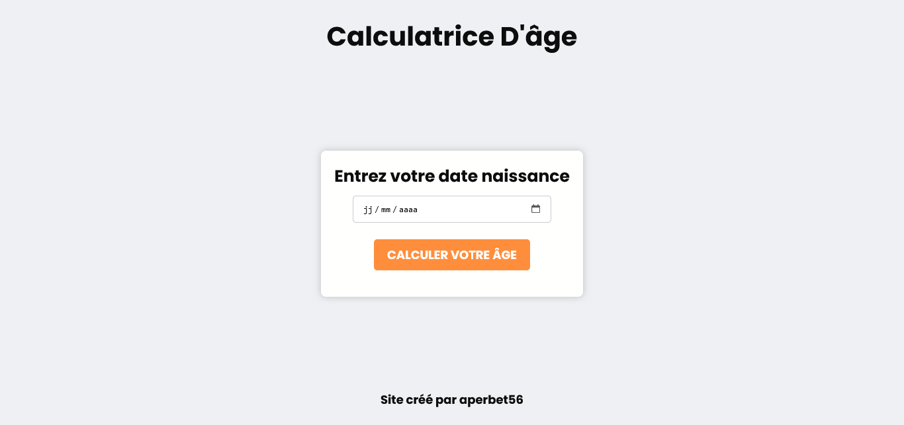

# Age Calculator App

## Le challenge

Mon but était de crééer une petite application permettant à chaque utilisateur de calculer son âge. Pour se faire :

- l'internaute doit renseigner sa date de naissance puis cliquer sur le bouton "Calculer votre âge". Quelques secondes plus tard, un paragraphe indiquant l'âge de l'utilisateur apparaît.

- Si l'internaute clique sur le bouton "Calculer votre age" sans avoir remplis le champ de saisie, alors une popup (alerte) apparaît sur l'écran.

- La page web est responsive : elle s'adapte parfaitement aux différentes résolutions d'écran (desktop, tablette et mobile);

## Démonstration

lien vers le projet : https://aperbet56.github.io/age_calculator/

## Projet développé avec

- Utilisation des balises sémantique HTML5
- CSS
- Animation sur le bouton au survol de la souris
- Importation de la police Poppins
- Flexbox
- JavaScript
- Desktop first
- Page web responsive
